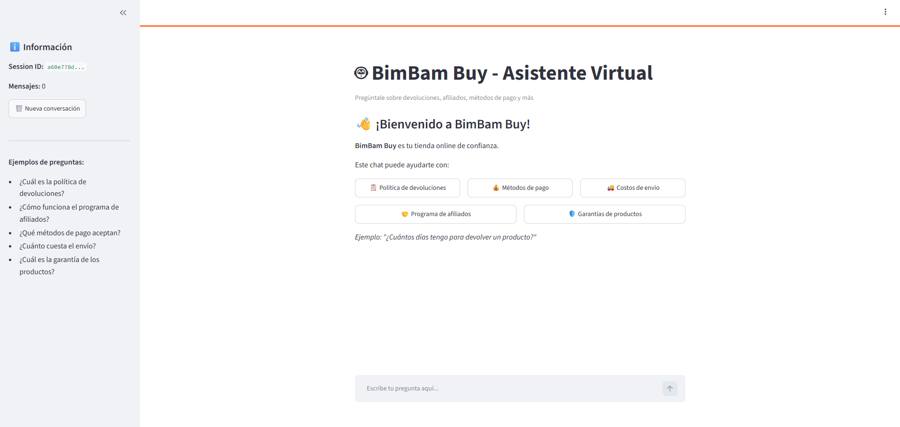
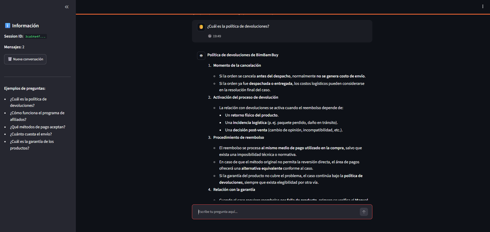
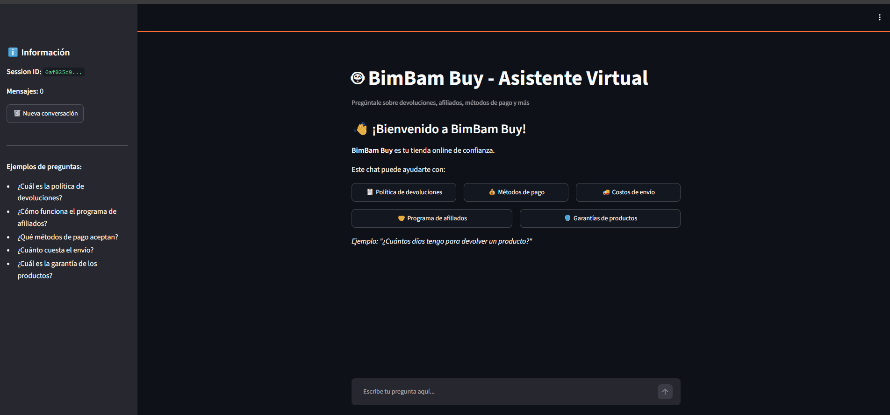

# 🤖 BimBam Buy — Asistente Virtual Inteligente

Un chatbot corporativo potenciado por Inteligencia Artificial que responde automáticamente las preguntas más frecuentes de los colaboradores de **BimBam Buy**, una tienda online de confianza.

El agente utiliza **RAG (Retrieval-Augmented Generation)** para buscar información en documentos oficiales de la empresa y generar respuestas precisas y actualizadas.

---

## 🏗️ Arquitectura de la Solución

```
┌──────────────────┐      ┌──────────────────┐      ┌──────────────────┐
│                  │      │                  │      │                  │
│    Streamlit     │─────►│     FastAPI      │─────►│  LangChain RAG   │
│    (Frontend)    │ HTTP │    (Backend)     │      │   (Pipeline)     │
│                  │      │                  │      │                  │
└──────────────────┘      └──────────────────┘      └────────┬─────────┘
                                                             │
                                              ┌──────────────┴──────────────┐
                                              │                             │
                                     ┌────────▼────────┐          ┌────────▼────────┐
                                     │                 │          │                 │
                                     │    ChromaDB     │          │  Groq + GPT-OSS │
                                     │  (Vectores)     │          │    (120B)       │
                                     │                 │          │                 │
                                     └─────────────────┘          └─────────────────┘
```

**Flujo de trabajo:**
1. El colaborador escribe una pregunta en el chat
2. El sistema busca los fragmentos más relevantes en los documentos
3. La IA genera una respuesta clara basada en la información encontrada
4. Se muestra la respuesta junto con las fuentes consultadas

---

## 💻 Tecnologías y Herramientas

| Componente | Tecnología | ¿Para qué sirve? |
|------------|-----------|-------------------|
| **Lenguaje** | Python 3.12 | Base del proyecto |
| **Frontend** | Streamlit | Interfaz de chat intuitiva |
| **Backend** | FastAPI | API REST de alta velocidad |
| **Motor RAG** | LangChain | Conecta búsqueda con generación |
| **Base de datos** | ChromaDB | Almacena documentos como vectores |
| **Embeddings** | HuggingFace | Convierte texto en números para buscar |
| **IA generativa** | Groq (GPT-OSS-120B) | Genera respuestas inteligentes |
| **Deploy** | Docker + Oracle Cloud | Ejecución en la nube |

---

## 🚀 Instrucciones para Ejecutar

### Opción 1: Con Docker (Recomendado)

```bash
# 1. Clonar el repositorio
git clone https://github.com/NicolasParadaA/challenge-alura-one.git
cd challenge-alura-one

# 2. Configurar variables de entorno
cp .env.example .env
# Editar .env y agregar tu GROQ_API_KEY (gratis en groq.com)

# 3. Ejecutar
docker-compose up -d --build
```

Abrir **http://localhost:8501** en el navegador.

### Opción 2: Sin Docker

```bash
# 1. Instalar dependencias
pip install -r requirements.txt

# 2. Indexar documentos
python ingest.py

# 3. Ejecutar Backend (Terminal 1)
uvicorn api:app --reload --port 8000

# 4. Ejecutar Frontend (Terminal 2)
streamlit run app.py
```

---

## 💬 Ejemplos de Preguntas que el Agente Puede Responder

El agente está entrenado con 5 documentos oficiales de BimBam Buy:

| Documento | Tema |
|-----------|------|
| 📋 Política de reembolsos | Devoluciones y reembolsos |
| 💳 Métodos de pago | Preguntas frecuentes sobre pagos |
| 🚚 Guía de envíos | Tiempos y costos por zona |
| 🛡️ Manual de garantía | Períodos y cobertura |
| 🤝 Programa de afiliados | Comisiones y reglas |

**Preguntas de ejemplo:**
- ¿Cuál es la política de devoluciones?
- ¿Qué métodos de pago aceptan?
- ¿Cuánto cuesta el envío?
- ¿Cómo funciona el programa de afiliados?
- ¿Cuál es la garantía de los productos?

---

## 📝 Ejemplos de Respuestas Generadas

### Pregunta: "¿Cuánto cuesta el envío?"

> El costo del envío no es un valor fijo, sino que se determina en función de varios factores:
>
> - Destino del pedido (país, región y ciudad).
> - Peso volumétrico y tamaño del paquete.
> - Servicio de entrega seleccionado (estándar, exprés, etc.).
> - Promociones vigentes y umbral de envío gratis que pueda aplicar en el país o campaña.
>
> El importe final del envío se muestra antes de confirmar la compra, de modo que el cliente siempre sabe cuánto pagará.
>
> En resumen, el precio del envío varía según destino, peso/tamaño, tipo de servicio y posibles promociones; se visualiza en el checkout antes de finalizar la compra.
>
> 📄 **Fuente:** guia-de-tiempos-y-costos-de-envio-de-bimbambuy.pdf

---

### Pregunta: "¿Cuál es la política de devoluciones?"

> **Política de devoluciones de BimBam Buy**
>
> **Momento de la cancelación**
> - Si la orden se cancela antes del despacho, normalmente no se genera costo de envío.
> - Si la orden ya fue despachada o entregada, los costos logísticos pueden considerarse al resolver la devolución.
>
> **Reembolsos por garantía**
> - Cuando el caso es por falla de producto, primero se verifica el Manual de Garantía de Productos.
> - Si la garantía aplica, el reembolso se procesa según lo indicado en el manual.
>
> **Método de reembolso**
> - El reembolso se realiza al mismo medio de pago usado en la compra, salvo que exista una imposibilidad técnica o normativa.
>
> **Factores que pueden variar por país**
> - Disponibilidad de métodos de pago y condiciones de reembolso pueden cambiar según normativa local, integración bancaria, moneda y monto.
>
> 📄 **Fuente:** politica-de-reembolsos-y-devoluciones-de-bimbambuy.pdf

---

### Pregunta: "¿Qué métodos de pago aceptan?"

> Los métodos de pago que BimBam Buy acepta son:
>
> - Tarjeta de crédito
> - Tarjeta de débito
> - Transferencia bancaria
> - Pago en efectivo en los puntos habilitados
> - Billeteras digitales (según el país)
> - Cuotas o financiamiento, cuando corresponda
>
> **Nota:** la disponibilidad de cada método puede variar según el país, la categoría del producto y el monto de la compra.
>
> 📄 **Fuente:** preguntas-frecuentes-sobre-metodos-de-pago-de-bimbambuy.pdf

---

### Pregunta: "¿Cómo funciona el programa de afiliados?"

> **Funcionamiento del Programa de Afiliados de BimBam Buy**
>
> **Participantes**
> - Solo pueden participar los afiliados aprobados por BimBam Buy y que operen en los países habilitados de LATAM.
>
> **Generación de comisión**
> - Se genera comisión cuando la compra se origina a través del enlace o código del afiliado, el pedido queda confirmado, no hay anulación fraudulenta, el pago está aprobado y la venta satisface las condiciones de atribución.
>
> **Actividades permitidas**
> - Promoción digital, contenidos editoriales y campañas que utilicen el código o enlace asignado.
> - Seguimiento de la atribución de cada venta.
> - Recepción de liquidaciones de comisiones y soporte ante incidencias del programa.
>
> **Relación con otros procesos**
> - Pagos: la liquidación de comisiones se gestiona junto al proceso de pagos.
> - Reembolsos y devoluciones: pueden generar ajustes en la comisión.
> - Envíos: el afiliado comunica la experiencia de compra, pero no influye en la logística.
>
> 📄 **Fuente:** programa-de-afiliados-de-bimbambuy.pdf

---

## ☁️ Deploy en Oracle Cloud

**Enlace público:** [http://144.22.62.189:8501](http://144.22.62.189:8501)

**Configuración de la VM:**
- Proveedor: Oracle Cloud Infrastructure (OCI)
- Tipo: VM.Standard.A1.Flex (ARM64)
- Recursos: 1 OCPU, 6GB RAM
- Sistema: Ubuntu 24.04

**Capturas de pantalla:**





**Demo en vivo:**


